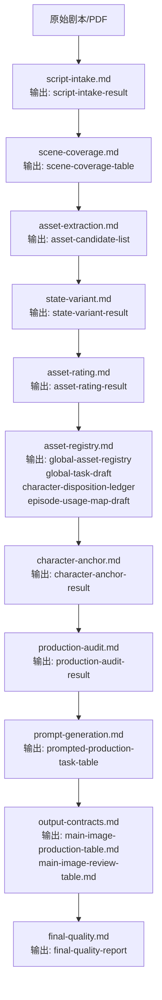

# V2.53 Workflow

## 核心原则

每个层级必须产出明确结果；后续层读取前序输出，不重新调用前序判断规则。表格只使用 `模块 / 层级 / 输入 / 调用文件 / 输出结果` 五列。

## 流程图

## 三大模块

| 模块 | 顺序 | 作用 |
|---|---|---|
| 剧本解析与资产识别 | `script-intake -> scene-coverage -> asset-extraction -> state-variant -> asset-rating -> asset-registry` | 建立事实、候选资产、状态、评级、全局任务草稿、人物候选去向台账和分集映射草稿。 |
| 资产生产与提示词生成 | `character-anchor -> production-audit -> prompt-generation` | 建立角色锚点、审计生产风险、生成提示词。 |
| 输出交付与质检 | `output-contracts -> final-quality` | 输出机器长表和人审短表，并做最终验收。 |

## 输入/输出契约

| 模块 | 层级 | 输入 | 调用文件 | 输出结果 |
|---|---|---|---|---|
| 剧本解析与资产识别 | `script-intake.md` | 原始剧本/PDF | `剧本解析输出规则.md` | `script-intake-result` |
| 剧本解析与资产识别 | `scene-coverage.md` | `script-intake-result` | `场次覆盖记录规则.md` | `scene-coverage-table` |
| 剧本解析与资产识别 | `asset-extraction.md` | `scene-coverage-table` | `资产抽取边界规则.md` | `asset-candidate-list` |
| 剧本解析与资产识别 | `state-variant.md` | `asset-candidate-list`、`scene-coverage-table` | `状态拆分规则.md` | `state-variant-result` |
| 剧本解析与资产识别 | `asset-rating.md` | `asset-candidate-list`、`state-variant-result`、`scene-coverage-table` | `人物评级规则.md`、`场景评级规则.md`、`道具评级规则.md` | `asset-rating-result` |
| 剧本解析与资产识别 | `asset-registry.md` | `asset-candidate-list`、`state-variant-result`、`asset-rating-result`、`scene-coverage-table` | `全局资产任务生成规则.md`、`任务类型字段审核规则.md`、`分集映射规则.md`、`人物候选去向闭环规则.md` | `global-asset-registry`、`global-task-draft`、`character-disposition-ledger`、`episode-usage-map-draft` |
| 资产生产与提示词生成 | `character-anchor.md` | `global-task-draft`、`asset-rating-result`、`state-variant-result` | `角色锚定规则.md`、`任务类型字段审核规则.md` | `character-anchor-result` |
| 资产生产与提示词生成 | `production-audit.md` | `global-asset-registry`、`global-task-draft`、`character-disposition-ledger`、`episode-usage-map-draft`、`character-anchor-result`、`scene-coverage-table` | `生产审计规则.md` | `production-audit-result` |
| 资产生产与提示词生成 | `prompt-generation.md` | `global-task-draft`、`character-anchor-result`、`production-audit-result` | `人物主图提示词模板.md`、`场景主图提示词模板.md`、`道具主图提示词模板.md`、`角色状态编辑模板.md`、`写实风格守卫.md`、`提示词语言守卫.md`、`角色状态编辑守卫.md` | `prompted-production-task-table` |
| 输出交付与质检 | `output-contracts.md` | `prompted-production-task-table`、`character-disposition-ledger`、`episode-usage-map-draft`、`production-audit-result` | `任务类型字段审核规则.md`、`分集映射规则.md`、`机器长表模板.md`、`人审短表模板.md` | `main-image-production-table.md`、`main-image-review-table.md` |
| 输出交付与质检 | `final-quality.md` | `main-image-production-table.md`、`main-image-review-table.md`、`production-audit-result` | `输出质量守卫.md` | `final-quality-report` |

## 输出接续检查

- `script-intake-result` 被 `scene-coverage.md` 接住。
- `scene-coverage-table` 被 `asset-extraction.md`、`state-variant.md`、`asset-rating.md`、`asset-registry.md`、`production-audit.md` 接住。
- `asset-candidate-list` 被 `state-variant.md`、`asset-rating.md`、`asset-registry.md` 接住。
- `state-variant-result` 被 `asset-rating.md`、`asset-registry.md`、`character-anchor.md` 接住。
- `asset-rating-result` 被 `asset-registry.md`、`character-anchor.md` 接住。
- `global-asset-registry` 被 `production-audit.md` 接住。
- `global-task-draft` 由 `asset-registry.md` 按 `全局资产任务生成规则.md` 生成，并被 `character-anchor.md`、`production-audit.md`、`prompt-generation.md` 接住。
- `character-disposition-ledger` 被 `production-audit.md`、`output-contracts.md` 接住。
- `episode-usage-map-draft` 被 `production-audit.md`、`output-contracts.md` 接住。
- `character-anchor-result` 被 `production-audit.md`、`prompt-generation.md` 接住。
- `production-audit-result` 被 `prompt-generation.md`、`output-contracts.md`、`final-quality.md` 接住。
- `prompted-production-task-table` 被 `output-contracts.md` 接住。
- `main-image-production-table.md` 和 `main-image-review-table.md` 被 `final-quality.md` 接住。
- `final-quality-report` 是终点输出。
