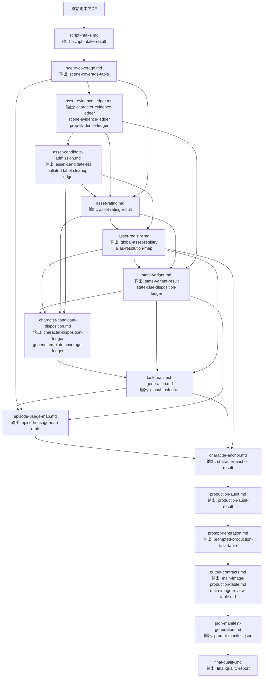

# V2.63 Workflow

## 核心原则

每个层级必须产出明确结果；后续层不得重新切场、不得重做其他层判断。V2.63 沿用 V2.62 的三类证据账本、评级和状态规则，并将 Seedance 中台导入文件 `prompt-manifest.json` 升级为默认主交付之一。评级发生在状态拆分之前；状态继承 base asset 的 `priority_level`。

证据账本只做事实归整和证据归一，不做候选准入、污染清洗台账、评级、注册或任务生成。候选准入层才决定哪些证据进入 `asset-candidate-list`，并只在准入时记录 `polluted-label-cleanup-ledger`。

`output-contracts.md` 只整理机器长表和人审短表。`json-manifest-generation.md` 在其后读取完成的 `main-image-production-table.md`，确定性投影生成 `prompt-manifest.json`。JSON 不得反向修改机器长表。

## 流程图

## 三大模块

| 模块 | 顺序 | 作用 |
|---|---|---|
| 剧本解析与资产识别 | `script-intake -> scene-coverage -> asset-evidence-ledger -> asset-candidate-admission -> asset-rating -> asset-registry -> state-variant -> character-candidate-disposition -> task-manifest-generation -> episode-usage-map` | 建立场次事实、三类评级前证据账本、候选资产、污染标签清洗记录、评级、base asset 注册表、S/A 状态索引、S/A 状态线索去向、人物候选去向、任务草稿和分集映射草稿。 |
| 资产生产与提示词生成 | `character-anchor -> production-audit -> prompt-generation` | 建立角色锚点、审计生产风险、生成提示词。 |
| 输出交付与质检 | `output-contracts -> json-manifest-generation -> final-quality` | 汇总完整机器长表和派生人审短表，从机器长表投影生成中台导入 JSON，并做最终契约验收。 |

## 输入/输出契约

| 模块 | 层级 | 输入 | 调用文件 | 输出结果 |
|---|---|---|---|---|
| 剧本解析与资产识别 | `script-intake.md` | 原始剧本/PDF | `剧本解析输出规则.md` | `script-intake-result` |
| 剧本解析与资产识别 | `scene-coverage.md` | `script-intake-result` | `场次覆盖记录规则.md` | `scene-coverage-table` |
| 剧本解析与资产识别 | `asset-evidence-ledger.md` | `scene-coverage-table`、原剧本 `source_evidence/source_locator` | `资产证据账本规则.md` | `character-evidence-ledger`、`scene-evidence-ledger`、`prop-evidence-ledger` |
| 剧本解析与资产识别 | `asset-candidate-admission.md` | `character-evidence-ledger`、`scene-evidence-ledger`、`prop-evidence-ledger`、`scene-coverage-table` | `资产候选准入规则.md`、`污染标签清洗规则.md` | `asset-candidate-list`、`polluted-label-cleanup-ledger` |
| 剧本解析与资产识别 | `asset-rating.md` | `character-evidence-ledger`、`scene-evidence-ledger`、`prop-evidence-ledger`、`asset-candidate-list`、`scene-coverage-table`、原剧本 `source_evidence/source_locator` | `人物评级规则.md`、`场景评级规则.md`、`道具评级规则.md` | `asset-rating-result` |
| 剧本解析与资产识别 | `asset-registry.md` | `asset-candidate-list`、`asset-rating-result` | `资产注册规则.md` | `global-asset-registry`、`alias-resolution-map` |
| 剧本解析与资产识别 | `state-variant.md` | `global-asset-registry`、`asset-rating-result`、`asset-candidate-list`、`character-evidence-ledger`、`scene-evidence-ledger`、`prop-evidence-ledger`、`scene-coverage-table` | `状态拆分规则.md` | `state-variant-result`、`state-clue-disposition-ledger`，均只覆盖 S/A 状态范围 |
| 剧本解析与资产识别 | `character-candidate-disposition.md` | `asset-candidate-list`、`asset-rating-result`、`global-asset-registry`、`alias-resolution-map` | `人物候选去向闭环规则.md` | `character-disposition-ledger`、`generic-template-coverage-ledger` |
| 剧本解析与资产识别 | `task-manifest-generation.md` | `global-asset-registry`、`state-variant-result`、`character-disposition-ledger`、`generic-template-coverage-ledger` | `全局资产任务生成规则.md`、`任务类型字段审核规则.md` | `global-task-draft` |
| 剧本解析与资产识别 | `episode-usage-map.md` | `scene-coverage-table`、`global-asset-registry`、`state-variant-result`、`global-task-draft`、`character-disposition-ledger`、`generic-template-coverage-ledger` | `分集映射规则.md` | `episode-usage-map-draft` |
| 资产生产与提示词生成 | `character-anchor.md` | `global-task-draft`、`global-asset-registry`、`state-variant-result` | `角色锚定规则.md`、`任务类型字段审核规则.md` | `character-anchor-result` |
| 资产生产与提示词生成 | `production-audit.md` | `scene-coverage-table`、`character-evidence-ledger`、`scene-evidence-ledger`、`prop-evidence-ledger`、`asset-candidate-list`、`polluted-label-cleanup-ledger`、`asset-rating-result`、`global-asset-registry`、`alias-resolution-map`、`state-variant-result`、`state-clue-disposition-ledger`、`character-disposition-ledger`、`generic-template-coverage-ledger`、`global-task-draft`、`episode-usage-map-draft`、`character-anchor-result` | `生产审计规则.md` | `production-audit-result` |
| 资产生产与提示词生成 | `prompt-generation.md` | `global-task-draft`、`character-anchor-result`、`production-audit-result` | `人物主图提示词模板.md`、`场景主图提示词模板.md`、`道具主图提示词模板.md`、`角色状态编辑模板.md`、`写实风格守卫.md`、`提示词语言守卫.md`、`角色状态编辑守卫.md` | `prompted-production-task-table` |
| 输出交付与质检 | `output-contracts.md` | `script-intake-result`、`character-evidence-ledger`、`scene-evidence-ledger`、`prop-evidence-ledger`、`global-asset-registry`、`alias-resolution-map`、`state-variant-result`、`state-clue-disposition-ledger`、`character-disposition-ledger`、`generic-template-coverage-ledger`、`polluted-label-cleanup-ledger`、`prompted-production-task-table`、`episode-usage-map-draft`、`production-audit-result`、`character-anchor-result` | `任务类型字段审核规则.md`、`分集映射规则.md`、`机器长表模板.md`、`人审短表模板.md` | `main-image-production-table.md`、`main-image-review-table.md` |
| 输出交付与质检 | `json-manifest-generation.md` | `main-image-production-table.md`、用户明确提供的 `contentId` 或项目元信息 | `中台JSON输出规则.md`、`prompt-manifest-json模板.md`、`seedance-element-extract-manifest-v1-contract.md`、`seedance-element-extract-manifest.v1.schema.json`、`generate_prompt_manifest.py` | `prompt-manifest.json` |
| 输出交付与质检 | `final-quality.md` | `prompt-manifest.json`、`main-image-production-table.md`、`main-image-review-table.md`、`production-audit-result` | `输出质量守卫.md`、`中台JSON质量守卫.md`、`validate_prompt_manifest.py` | `final-quality-report` |

## 输出接续检查

- `script-intake-result` 被 `scene-coverage.md` 和 `output-contracts.md` 接住。
- `scene-coverage-table` 被 `asset-evidence-ledger.md`、`asset-candidate-admission.md`、`asset-rating.md`、`state-variant.md`、`episode-usage-map.md`、`production-audit.md` 接住。
- `character-evidence-ledger` 被 `asset-candidate-admission.md`、`asset-rating.md`、`state-variant.md`、`production-audit.md`、`output-contracts.md` 接住。
- `scene-evidence-ledger` 被 `asset-candidate-admission.md`、`asset-rating.md`、`state-variant.md`、`production-audit.md`、`output-contracts.md` 接住。
- `prop-evidence-ledger` 被 `asset-candidate-admission.md`、`asset-rating.md`、`state-variant.md`、`production-audit.md`、`output-contracts.md` 接住。
- `asset-candidate-list` 被 `asset-rating.md`、`asset-registry.md`、`state-variant.md`、`character-candidate-disposition.md`、`production-audit.md` 接住。
- `polluted-label-cleanup-ledger` 由 `asset-candidate-admission.md` 生成，并被 `production-audit.md` 和 `output-contracts.md` 接住。
- `asset-rating-result` 被 `asset-registry.md`、`state-variant.md`、`character-candidate-disposition.md`、`production-audit.md` 接住。
- `global-asset-registry` 被 `state-variant.md`、`character-candidate-disposition.md`、`task-manifest-generation.md`、`episode-usage-map.md`、`character-anchor.md`、`production-audit.md`、`output-contracts.md` 接住。
- `alias-resolution-map` 被 `character-candidate-disposition.md`、`production-audit.md`、`output-contracts.md` 接住。
- `state-variant-result` 被 `task-manifest-generation.md`、`episode-usage-map.md`、`character-anchor.md`、`production-audit.md`、`output-contracts.md` 接住。
- `state-clue-disposition-ledger` 只承载 S/A 状态线索去向，被 `production-audit.md` 和 `output-contracts.md` 接住。
- `character-disposition-ledger` 被 `task-manifest-generation.md`、`episode-usage-map.md`、`production-audit.md`、`output-contracts.md` 接住。
- `generic-template-coverage-ledger` 被 `task-manifest-generation.md`、`episode-usage-map.md`、`production-audit.md`、`output-contracts.md` 接住。
- `global-task-draft` 由 `task-manifest-generation.md` 生成，并被 `episode-usage-map.md`、`character-anchor.md`、`production-audit.md`、`prompt-generation.md` 接住。
- `episode-usage-map-draft` 由 `episode-usage-map.md` 生成，并被 `production-audit.md`、`output-contracts.md` 接住。
- `character-anchor-result` 被 `production-audit.md`、`prompt-generation.md`、`output-contracts.md` 接住。
- `production-audit-result` 被 `prompt-generation.md`、`output-contracts.md`、`final-quality.md` 接住。
- `prompted-production-task-table` 被 `output-contracts.md` 接住，并进入机器长表生产任务章节。
- `main-image-production-table.md` 被 `json-manifest-generation.md` 和 `final-quality.md` 接住。
- `main-image-review-table.md` 被 `final-quality.md` 接住。
- `prompt-manifest.json` 被 `final-quality.md` 接住。
- `final-quality-report` 是终点输出。
