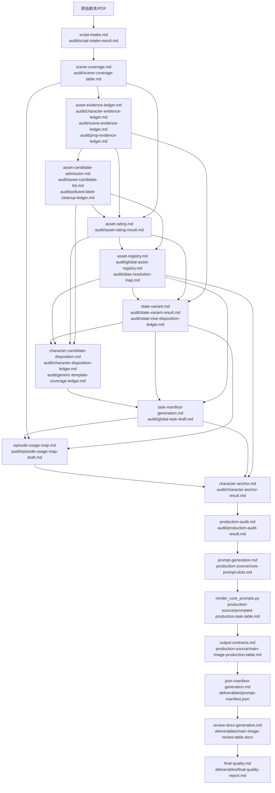

# V3.1.1 Workflow

## 核心原则

每个层级必须产出明确结果；后续层不得重新切场、不得重做其他层判断。V3.1.1 在 V3.1 基础上沿用三类证据账本、评级、S/A 状态规则、中文 core prompt、DOCX 人审交付和 C 级可见角色独立任务口径，并强化 core prompt 槽位的可画视觉细节规则。

`artifact-manifest.json` 是项目产物总索引。所有脚本阶段必须通过 manifest 定位生产源和交付路径，不得扫描目录、不得从旧产物猜测输入、不得从 `audit/` 补生产字段。

`prompt-generation.md` 只生成 `production-source/core-prompt-slots.md`。`scripts/render_core_prompts.py` 读取槽位表和渲染模板，确定性生成 `production-source/prompted-production-task-table.md`。模型不得直接手写整段最终 prompt。

`output-contracts.md` 只整理 `production-source/main-image-production-table.md`。该文件是瘦生产源表，只承载 JSON/DOCX 需要读取的生产字段，不承载完整中间审计包。

`json-manifest-generation.md` 读取 manifest 中登记的 `production-source/main-image-production-table.md`，确定性投影生成 `deliverables/prompt-manifest.json`。`review-docx-generation.md` 再读取同一生产源，确定性派生 `deliverables/main-image-review-table.docx`。JSON 和 DOCX 都不得反向修改生产源。

第三模块固定顺序：

```text
output-contracts -> json-manifest-generation -> review-docx-generation -> final-quality
```

## 项目输出结构

```text
project-output/
├─ artifact-manifest.json
├─ audit/
│  ├─ script-intake-result.md
│  ├─ scene-coverage-table.md
│  ├─ character-evidence-ledger.md
│  ├─ scene-evidence-ledger.md
│  ├─ prop-evidence-ledger.md
│  ├─ asset-candidate-list.md
│  ├─ polluted-label-cleanup-ledger.md
│  ├─ asset-rating-result.md
│  ├─ global-asset-registry.md
│  ├─ alias-resolution-map.md
│  ├─ state-variant-result.md
│  ├─ state-clue-disposition-ledger.md
│  ├─ character-disposition-ledger.md
│  ├─ generic-template-coverage-ledger.md
│  ├─ global-task-draft.md
│  ├─ episode-usage-map-draft.md
│  ├─ character-anchor-result.md
│  └─ production-audit-result.md
├─ production-source/
│  ├─ core-prompt-slots.md
│  ├─ prompted-production-task-table.md
│  └─ main-image-production-table.md
└─ deliverables/
   ├─ prompt-manifest.json
   ├─ main-image-review-table.docx
   └─ final-quality-report.md
```

## 流程图



## 三大模块

| 模块 | 顺序 | 作用 |
|---|---|---|
| 剧本解析与资产识别 | `script-intake -> scene-coverage -> asset-evidence-ledger -> asset-candidate-admission -> asset-rating -> asset-registry -> state-variant -> character-candidate-disposition -> task-manifest-generation -> episode-usage-map` | 建立场次事实、三类评级前证据账本、候选资产、污染标签清洗记录、评级、base asset 注册表、S/A 状态索引、S/A 状态线索去向、人物候选去向、任务草稿和分集映射草稿；所有中间结果写入 `audit/`。 |
| 资产生产与提示词生成 | `character-anchor -> production-audit -> prompt-generation` | 建立角色锚点、审计生产风险、生成 core prompt 槽位，并由脚本渲染中文 core prompt 或中文状态编辑 core instruction。 |
| 输出交付与质检 | `output-contracts -> json-manifest-generation -> review-docx-generation -> final-quality` | 汇总瘦生产源表，从生产源投影生成中台导入 JSON，从生产源派生人审 DOCX，并做最终契约验收。 |

## 输入/输出契约

| 模块 | 层级 | 输入 | 调用文件 | 输出结果 |
|---|---|---|---|---|
| 剧本解析与资产识别 | `script-intake.md` | 原始剧本/PDF | `剧本解析输出规则.md` | `audit/script-intake-result.md` |
| 剧本解析与资产识别 | `scene-coverage.md` | `audit/script-intake-result.md` | `场次覆盖记录规则.md` | `audit/scene-coverage-table.md` |
| 剧本解析与资产识别 | `asset-evidence-ledger.md` | `audit/scene-coverage-table.md`、原剧本 `source_evidence/source_locator` | `资产证据账本规则.md` | `audit/character-evidence-ledger.md`、`audit/scene-evidence-ledger.md`、`audit/prop-evidence-ledger.md` |
| 剧本解析与资产识别 | `asset-candidate-admission.md` | 三类 evidence ledger、`audit/scene-coverage-table.md` | `资产候选准入规则.md`、`污染标签清洗规则.md` | `audit/asset-candidate-list.md`、`audit/polluted-label-cleanup-ledger.md` |
| 剧本解析与资产识别 | `asset-rating.md` | 三类 evidence ledger、`audit/asset-candidate-list.md`、`audit/scene-coverage-table.md`、原剧本 `source_evidence/source_locator` | `人物评级规则.md`、`场景评级规则.md`、`道具评级规则.md` | `audit/asset-rating-result.md` |
| 剧本解析与资产识别 | `asset-registry.md` | `audit/asset-candidate-list.md`、`audit/asset-rating-result.md` | `资产注册规则.md` | `audit/global-asset-registry.md`、`audit/alias-resolution-map.md` |
| 剧本解析与资产识别 | `state-variant.md` | `audit/global-asset-registry.md`、`audit/asset-rating-result.md`、`audit/asset-candidate-list.md`、三类 evidence ledger、`audit/scene-coverage-table.md` | `状态拆分规则.md` | `audit/state-variant-result.md`、`audit/state-clue-disposition-ledger.md`，均只覆盖 S/A 状态范围 |
| 剧本解析与资产识别 | `character-candidate-disposition.md` | `audit/asset-candidate-list.md`、`audit/asset-rating-result.md`、`audit/global-asset-registry.md`、`audit/alias-resolution-map.md` | `人物候选去向闭环规则.md` | `audit/character-disposition-ledger.md`、`audit/generic-template-coverage-ledger.md` |
| 剧本解析与资产识别 | `task-manifest-generation.md` | `audit/global-asset-registry.md`、`audit/state-variant-result.md`、`audit/character-disposition-ledger.md`、`audit/generic-template-coverage-ledger.md` | `全局资产任务生成规则.md`、`任务类型字段审核规则.md` | `audit/global-task-draft.md` |
| 剧本解析与资产识别 | `episode-usage-map.md` | `audit/scene-coverage-table.md`、`audit/global-asset-registry.md`、`audit/state-variant-result.md`、`audit/global-task-draft.md`、`audit/character-disposition-ledger.md`、`audit/generic-template-coverage-ledger.md` | `分集映射规则.md` | `audit/episode-usage-map-draft.md` |
| 资产生产与提示词生成 | `character-anchor.md` | `audit/global-task-draft.md`、`audit/global-asset-registry.md`、`audit/state-variant-result.md` | `角色锚定规则.md`、`任务类型字段审核规则.md` | `audit/character-anchor-result.md` |
| 资产生产与提示词生成 | `production-audit.md` | `audit/` 中全部已完成上游产物 | `生产审计规则.md` | `audit/production-audit-result.md` |
| 资产生产与提示词生成 | `prompt-generation.md` | `audit/global-task-draft.md`、`audit/character-anchor-result.md`、`audit/production-audit-result.md`、必要 evidence/registry/state 产物 | `core-prompt-slots规则.md`、`core-prompt-slots模板.md`、各资产渲染模板和守卫 | `production-source/core-prompt-slots.md` |
| 资产生产与提示词生成 | `render_core_prompts.py` | `artifact-manifest.json`、`production-source/core-prompt-slots.md`、`core-prompt-render-templates.json` | `render_core_prompts.py`、`validate_core_prompt_slots.py` | `production-source/prompted-production-task-table.md` |
| 输出交付与质检 | `output-contracts.md` | `audit/global-asset-registry.md`、`audit/alias-resolution-map.md`、`audit/state-variant-result.md`、`audit/episode-usage-map-draft.md`、`audit/production-audit-result.md`、`audit/character-anchor-result.md`、`production-source/prompted-production-task-table.md` | `任务类型字段审核规则.md`、`分集映射规则.md`、`机器长表模板.md` | `production-source/main-image-production-table.md` |
| 输出交付与质检 | `json-manifest-generation.md` | `artifact-manifest.json`、manifest 登记的 production source、用户明确提供的 `contentId` 或项目元信息 | `中台JSON输出规则.md`、`prompt-manifest-json模板.md`、JSON contract/schema、`generate_prompt_manifest.py` | `deliverables/prompt-manifest.json` |
| 输出交付与质检 | `review-docx-generation.md` | `artifact-manifest.json`、manifest 登记的 production source | `人审DOCX表格模板.md`、`generate_review_docx.py` | `deliverables/main-image-review-table.docx` |
| 输出交付与质检 | `final-quality.md` | `artifact-manifest.json`、production source、deliverables、`audit/production-audit-result.md` | `输出质量守卫.md`、`中台JSON质量守卫.md`、manifest/production/JSON/DOCX 校验脚本 | `deliverables/final-quality-report.md` |

## 输出接续检查

- 所有 `audit/` 中间产物必须在 `artifact-manifest.json` 登记为 `role: audit`。
- `production-source/core-prompt-slots.md` 必须登记为 `role: production_source`，由 `render_core_prompts.py` 读取。
- `production-source/prompted-production-task-table.md` 必须登记为 `role: production_source`，由 `output-contracts.md` 读取。
- `production-source/main-image-production-table.md` 必须登记为 `role: production_source`，由 JSON、DOCX 和 final-quality 脚本读取。
- `deliverables/prompt-manifest.json`、`deliverables/main-image-review-table.docx`、`deliverables/final-quality-report.md` 必须登记为 `role: deliverable` 或 `validation_report`。
- JSON/DOCX 生成脚本不得读取 `audit/` 作为生产字段来源；如果 manifest 把 audit 路径登记为生产源，脚本必须失败。
- `main-image-production-table.md` 不再承载完整 evidence ledger、候选去向、污染清洗、状态线索去向等审计长表；这些内容保留在 `audit/`，生产源表只保留 JSON/DOCX 需要的稳定字段和必要审计摘要。
- `final-quality-report.md` 是终点输出，不反向修改任何上游产物。
